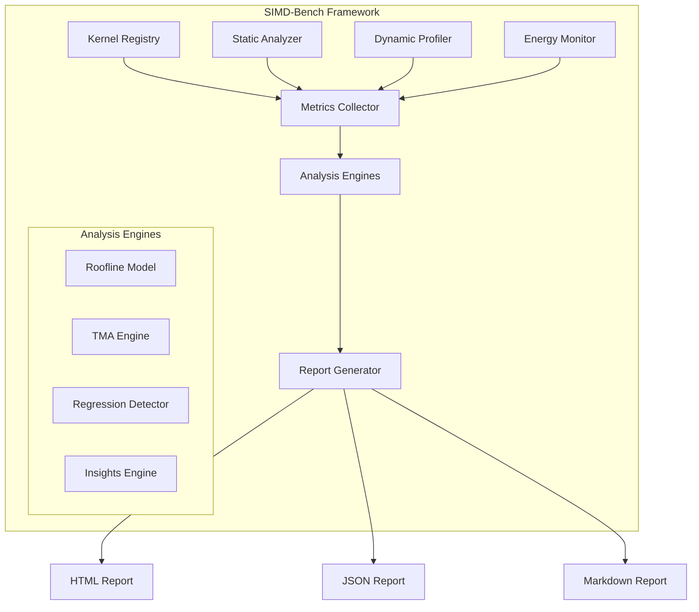

# SIMD-Bench: Holistic SIMD Kernel Analysis Tool

[](https://opensource.org/licenses/MIT)
[](https://en.cppreference.com/w/cpp/17)
[](#hardware-support)

SIMD-Bench is a comprehensive framework for profiling, benchmarking, and iteratively improving SIMD kernels across multiple hardware platforms. It provides a holistic view of kernel performance by integrating timing, hardware performance counters, energy profiling, and automated microarchitectural analysis.

---

## Key Features

- **Cross-Platform Support**: Native support for x86 (SSE/AVX/AVX-512), ARM (NEON/SVE), and RISC-V (RVV) via [Google Highway](https://github.com/google/highway).
- **Holistic Metrics**: Covers performance (GFLOPS, IPC), SIMD efficiency, memory bandwidth, and cache utilization.
- **Built-in Analysis Engines**:
    - **Roofline Model**: Automated arithmetic intensity bounds analysis.
    - **Top-Down Microarchitecture Analysis (TMA)**: Identifies bottlenecks in the pipeline (Frontend, Backend, Retiring, Bad Speculation).
- **Insights Provider**: A rule-based engine that provides actionable optimization recommendations.
- **Energy Profiling**: Integrated RAPL/PowerAPI support for measuring power consumption and energy efficiency.
- **Correctness Verification**: Automated numerical accuracy checks against reference scalar implementations.
- **Flexible Reporting**: Generates reports in JSON, Markdown, and HTML formats.

---

## Architecture

SIMD-Bench is designed with a modular architecture to ensure extensibility and portability.



### Core Components

| Component | Description |
|-----------|-------------|
| **Kernel Registry** | Manages kernel definitions, variants, and metadata. |
| **Metrics Collector** | Aggregates data from hardware counters, timers, and energy monitors. |
| **Analysis Engines** | Processes raw metrics to provide high-level insights (Roofline, TMA, Insights). |
| **Insights Engine** | Rule-based system that detects performance patterns and suggests optimizations. |
| **Report Generator** | Formats analysis results into human and machine-readable reports. |

---

## Metrics Framework

SIMD-Bench tracks a wide array of metrics to provide a 360-degree view of kernel performance.

### 1. Performance Metrics
- **GFLOPS/GOPS**: Throughput of floating-point and integer operations.
- **IPC/CPI**: Instructions per cycle and cycles per instruction.
- **Latency**: Time to process a single element (measured via RDTSC).

### 2. SIMD-Specific Metrics
- **Vectorization Ratio**: Percentage of packed vs. scalar instructions.
- **Vector Capacity Usage**: Efficiency of SIMD lane utilization.
- **SIMD Efficiency**: Achieved speedup vs. theoretical maximum for the target ISA.

### 3. Memory & Cache Metrics
- **Arithmetic Intensity**: FLOPs per byte transferred (crucial for Roofline analysis).
- **Bandwidth Utilization**: Percentage of peak memory bandwidth achieved.
- **Cache Hit/Miss Rates**: Detailed breakdown for L1, L2, and LLC.

### 4. Energy Metrics
- **Package/Core/DRAM Power**: Real-time power consumption via RAPL.
- **Energy per Op**: Efficiency metric (nJ/FLOP).
- **Energy-Delay Product (EDP)**: Combined performance and energy metric.

---

## Insights Provider

The **Insights Provider** is one of the most powerful features of SIMD-Bench. It uses an advanced rule-based engine to automatically analyze collected metrics and provide actionable optimization recommendations tailored to your specific hardware and kernel characteristics.

### Architecture

The Insights Engine consists of multiple components working together:

1. **Rule-Based Analyzer**: Over 16 specialized rules that examine different performance aspects.
2. **Classification System**: Categorizes insights by type, severity, and confidence level.
3. **Hardware-Aware Thresholds**: Adapts recommendations based on detected CPU capabilities.
4. **Cross-Kernel Analysis**: Identifies patterns across multiple benchmarks.

### Insight Categories

Insights are organized into 14 distinct categories:

- **MEMORY_BOUND**: Identifies memory bandwidth and latency limitations
- **COMPUTE_BOUND**: Detects compute throughput bottlenecks
- **VECTORIZATION**: Analyzes SIMD efficiency and opportunities
- **CACHE_EFFICIENCY**: Evaluates cache utilization patterns
- **DATA_ALIGNMENT**: Checks for alignment-related performance issues
- **LOOP_OPTIMIZATION**: Suggests loop unrolling, tiling, and fusion
- **BRANCH_PREDICTION**: Identifies branch misprediction penalties
- **INSTRUCTION_MIX**: Analyzes instruction pipeline efficiency
- **ARITHMETIC_INTENSITY**: Recommends ways to improve FLOP/byte ratio
- **LATENCY_HIDING**: Suggests prefetching and pipelining strategies
- **GENERAL**: Provides miscellaneous optimizations

### Severity and Confidence Levels

Each insight is tagged with:

**Severity Classification:**
- **CRITICAL**: Major performance issues with >50% potential improvement
- **HIGH**: Significant issues with 20-50% improvement potential
- **MEDIUM**: Moderate issues with 5-20% improvement potential
- **LOW**: Minor issues with <5% improvement potential
- **INFO**: Informational recommendations

**Confidence Classification:**
- **HIGH**: Strong evidence from multiple metrics (e.g., roofline position + bandwidth utilization)
- **MEDIUM**: Moderate evidence from related metrics
- **LOW**: Weak evidence requiring further investigation

### Rule-Based Detection Examples

#### 1. Memory Bandwidth Limited
**Detection Logic**: AI < ridge_point (where ridge_point = peak_gflops / memory_bw)

**Evidence Analyzed**:
- Arithmetic intensity vs. ridge point
- Bandwidth utilization percentage
- Roofline position

**Recommendations Provided**:
- Increase arithmetic intensity through data reuse (loop tiling/blocking)
- Reduce memory traffic via compression or quantization
- Improve cache utilization with better data locality
- Consider kernel fusion to amortize memory access costs
- Use prefetching to hide memory latency

#### 2. Low Vectorization Ratio
**Detection Logic**: vectorization_ratio < 30% (for non-scalar variants)

**Evidence Analyzed**:
- Ratio of packed vs. scalar instructions from hardware counters
- Comparison against expected SIMD width

**Recommendations Provided**:
- Check for loop-carried dependencies
- Convert Array-of-Structures (AoS) to Structure-of-Arrays (SoA)
- Add `restrict` keyword to eliminate pointer aliasing
- Replace conditional branches with masked operations
- Use vectorized math libraries for function calls

#### 3. High Cache Miss Rate
**Detection Logic**: L1_miss_rate > 5%

**Evidence Analyzed**:
- Cache miss rates at L1, L2, and LLC levels
- Working set size vs. cache capacity

**Recommendations Provided**:
- Loop tiling with cache-aware tile sizes (calculated based on detected cache hierarchy)
- Software prefetch hints with optimal distance
- Sequential access pattern enforcement
- Working set reduction strategies

#### 4. Low Instructions Per Cycle (IPC)
**Detection Logic**: IPC < 1.0 (expected ~3.0 for vectorized code)

**Evidence Analyzed**:
- IPC from hardware counters
- Memory bandwidth utilization
- Branch misprediction indicators

**Recommendations Provided**:
- Break long dependency chains with multiple accumulators
- Use FMA instructions for better throughput
- Reduce code size to improve instruction cache hit rate
- Apply branchless coding techniques

#### 5. Memory Latency Bound (vs. Bandwidth)
**Detection Logic**: Low IPC + Low bandwidth utilization

**Evidence Analyzed**:
- IPC < 1.0
- Bandwidth utilization < 30%
- Distinguishes latency-bound from bandwidth-bound

**Recommendations Provided**:
- Software prefetching with calculated optimal distance
- Increase instruction-level parallelism (ILP)
- Convert pointer-chasing patterns to arrays
- Cache blocking to ensure working set fits

### Code Examples in Insights

Many insights include concrete code examples. For instance, the loop unrolling insight provides:

```cpp
// Before: Single accumulator with dependency chain
float sum = 0;
for (int i = 0; i < N; i++) sum += a[i];

// After: 4x unroll with independent accumulators
float sum0=0, sum1=0, sum2=0, sum3=0;
for (int i = 0; i < N; i += 4) {
    sum0 += a[i];   sum1 += a[i+1];
    sum2 += a[i+2]; sum3 += a[i+3];
}
sum = sum0 + sum1 + sum2 + sum3;
```

### Hardware-Specific Recommendations

The Insights Engine adapts recommendations based on detected hardware:

- **Cache Sizes**: Tile sizes are calculated using actual L1/L2/L3 cache sizes
- **Vector Width**: SIMD recommendations match the maximum vector width (128/256/512-bit)
- **AVX-512 Awareness**: Warns about frequency throttling on applicable Intel processors
- **FMA Support**: Only recommends FMA instructions if hardware supports them

### Integration with Analysis Engines

Insights are generated in conjunction with:

- **Roofline Model**: Classifies kernels as memory-bound or compute-bound
- **TMA (Top-Down Microarchitecture Analysis)**: Provides pipeline-level insights
- **Energy Profiling**: Recommends energy-efficient optimizations

### Actionable Next Steps

The Insights Engine prioritizes recommendations and generates a "next steps" list sorted by:
1. Severity (CRITICAL first)
2. Potential speedup estimate
3. Implementation complexity

This ensures developers focus on the most impactful optimizations first.

---

## Setup and Installation

### Prerequisites
- CMake 3.16+
- C++17 compatible compiler (GCC 9+, Clang 10+, MSVC 2019+)
- **Optional Dependencies**:
    - `PAPI`: For hardware performance counters.
    - `LIKWID`: Alternative for x86/ARM performance monitoring.
    - `Google Test`: For running the test suite.
    - `nlohmann_json`: For JSON reporting (automatically downloaded if missing).

### Building from Source

```bash
git clone https://github.com/BudEcosystem/simd-bench.git
cd simd-bench
mkdir build && cd build
cmake .. -DSIMD_BENCH_ENABLE_PAPI=ON -DSIMD_BENCH_ENABLE_LIKWID=ON
make -j$(nproc)
```

---

## Usage Guide

### 1. Defining a Kernel
Use the `KernelBuilder` API to register your kernels and their variants.

```cpp
#include "simd_bench/simd_bench.h"

void register_my_kernel() {
    KernelBuilder("dot_product")
        .description("Vector dot product")
        .category("BLAS-1")
        .arithmetic_intensity(0.25)
        .flops_per_element(2)
        .add_variant("scalar", scalar_impl, "scalar", true)
        .add_variant("simd", simd_impl, "avx2", false)
        .sizes({1024, 4096, 16384})
        .setup(setup_func)
        .teardown(teardown_func)
        .register_kernel();
}
```

### 2. Running Benchmarks
The `BenchmarkRunner` handles execution, warmup, and metric collection.

```cpp
int main() {
    BenchmarkRunner runner;
    runner.enable_hardware_counters(true);
    runner.enable_energy_profiling(true);
    
    auto results = runner.run_all();
    
    JSONReportGenerator json_gen;
    std::cout << json_gen.generate(results) << std::endl;
    
    return 0;
}
```

---

## Hardware Support

| Architecture | SIMD Extensions |
|--------------|-----------------|
| **x86-64**   | SSE, AVX, AVX2, AVX-512 |
| **ARM**      | NEON, SVE, SVE2 |
| **RISC-V**   | RVV (Vector Extension 1.0) |
| **WebAssembly**| Fixed-width SIMD |

---

## License

This project is licensed under the MIT License - see the [LICENSE](LICENSE) file for details.
